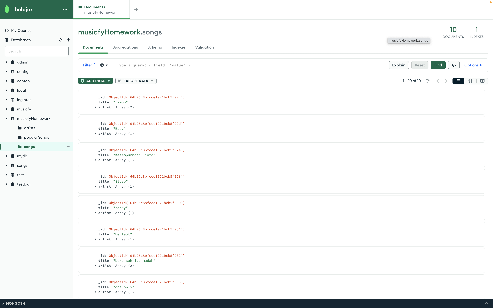
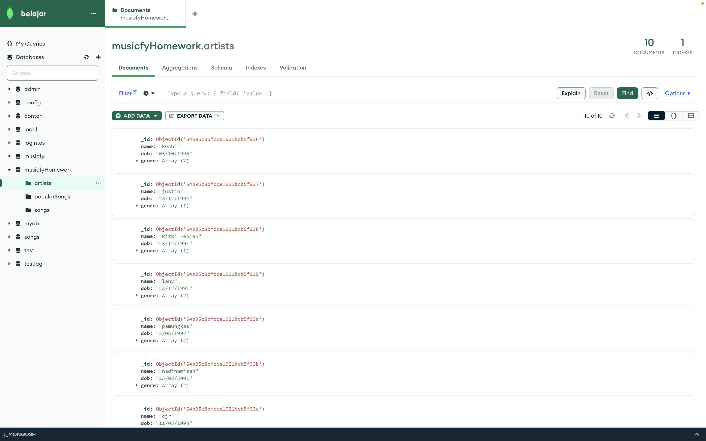
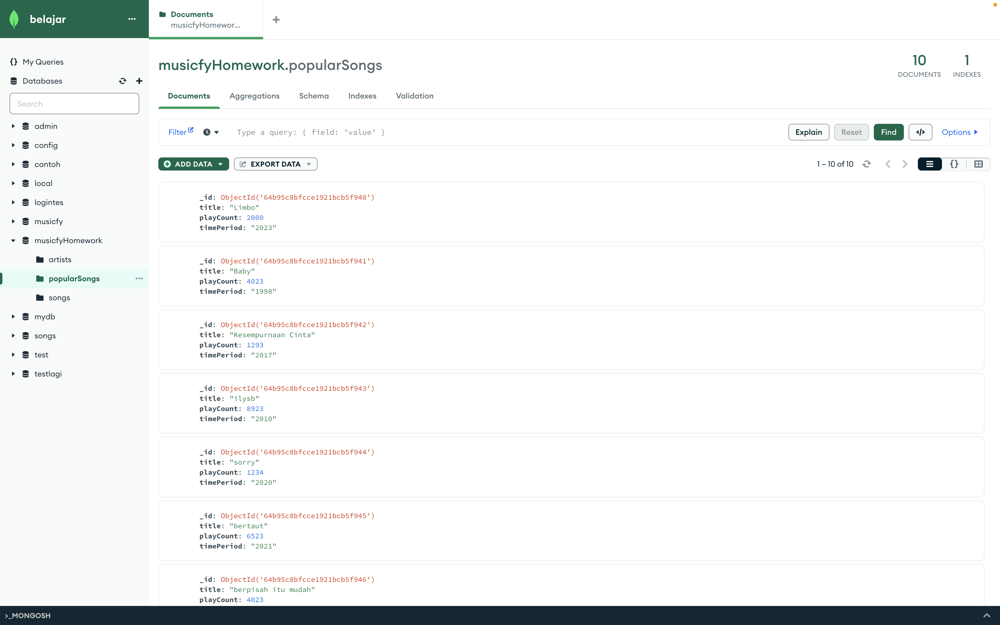

# Module 3.1 - Musicfy
- Muhamad Putra Satria
- GG3FSGP0442

## - Deskripsi Tugas
1. Create a database that stores the following information:
    - Songs, containing the following data: the title of the song, the name of the artist(s), and the album.
    - Artists, containing the following data: name, date of birth, genre(s).
    - Popular Songs, containing the following data: the title of the song, how many times it’s played, period of time.
2.  Populate the database you’ve created above with at least 10 data for each collection.


## - Cara Penggunaan

### Clone Proyek

Anda dapat mendapatkan salinan proyek ini dengan melakukan clone dari repository ini ke dalam direktori lokal Anda menggunakan perintah berikut:

```bash
git clone https://github.com/mpsalunggg/module3.1_Musicfy.git
```

### Install MongoDB Compass
Silahkan install mongoDB Compass pada link berikut [LINK](https://www.mongodb.com/docs/compass/master/install/)

### Install MongoShell (Opsional)
Silahkan install mongoDB Shell pada link berikut [LINK](https://www.mongodb.com/docs/mongodb-shell/install/)

### Port
Atur port sesuai yang diinginkan, untuk project ini menggunakan port 2111

```bash
mongosh --host localhost --port 2111
```

**Atau Jika Menggunakan Docker Lakukan Perintah Berikut:**
Pull image MongoDB versi 6.0 dari Docker Hub

```bash
docker pull mongo:6.0
```

Membuat container baru dan menghubungkan port:

```bash
docker run -d -p 2111:27017 --name <nama_container> mongo:6.0
```

Running Container:

```bash
docker start <nama_container>
```

### Install NPM
Lakukan NPM install untuk mengunduh semua package yang digunakan

```bash
npm install
```

### Running Project

```bash
npm run start
```
Setelah berhasil menjalankan project dan berhasil menambahkan ketiga Collection maka akan muncul hasil console

```bash
Ketiga data Collection berhasil ditambahkan!
```

## - Hasil MongoDB Compass

### Collection Songs

### Collection Artists

### Collection PopularSongs
